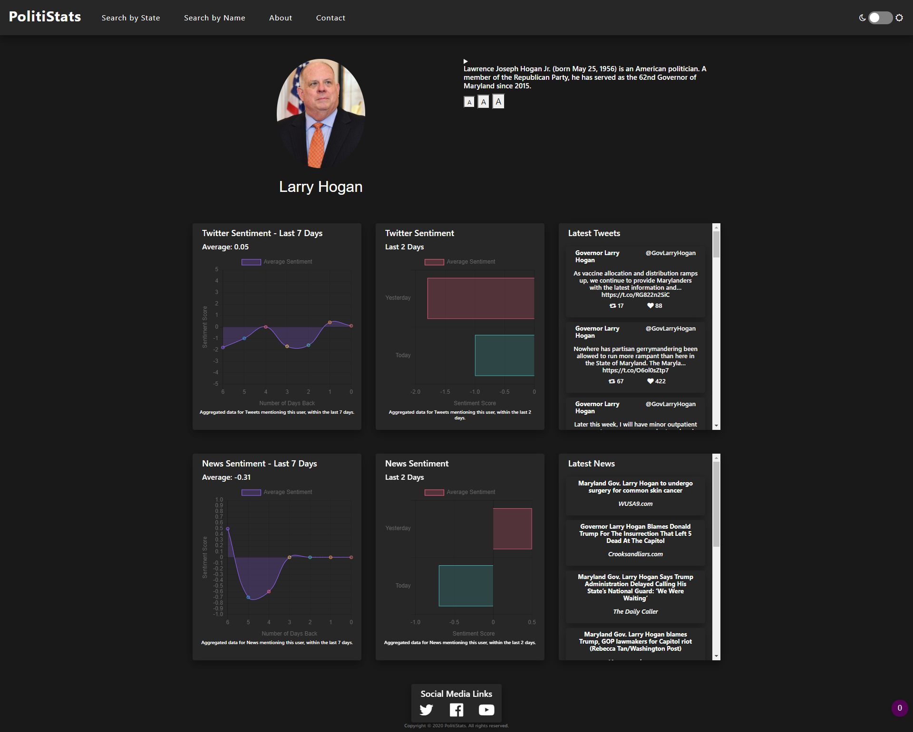

# Politistats

The overall goal of our project is to increase political awareness in the least biased way possible. The United States experiences rampant voter apathy and lack of participation. Since a healthy and functioning democracy required informed and active citizenry, the eventual goal of our project is to strengthen American democracy.

To accomplish this, our project takes the voting state of the user as an input, and issues a call to Google Civics API, and displays major political figures of that state (senators, governor, etc.) The website then lets a user learn more about the figure, by displaying their picture, biographical information, sentiment, and corresponding plots.

